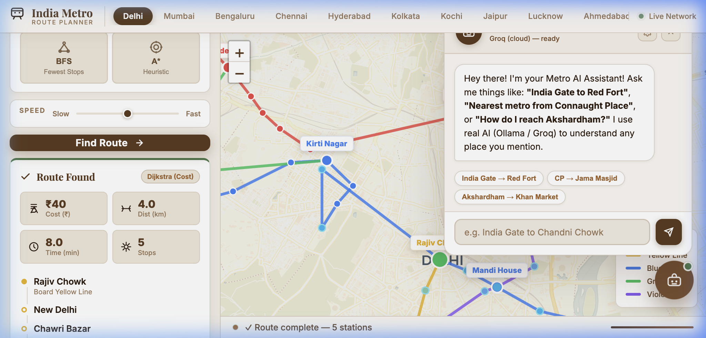
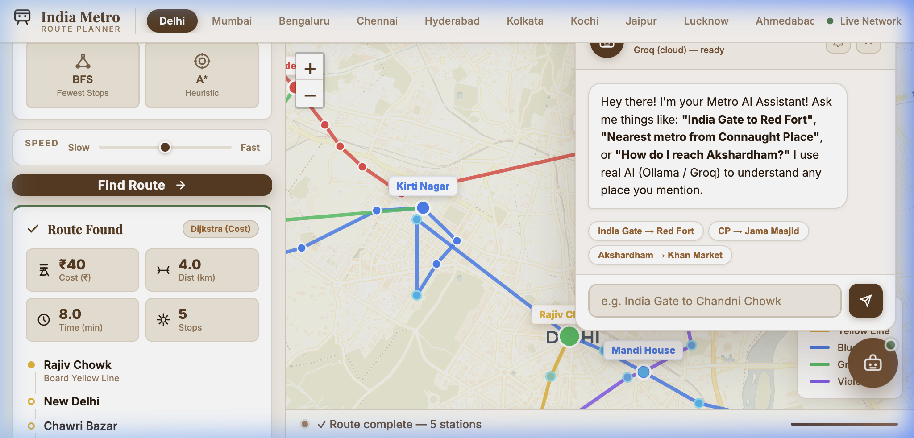
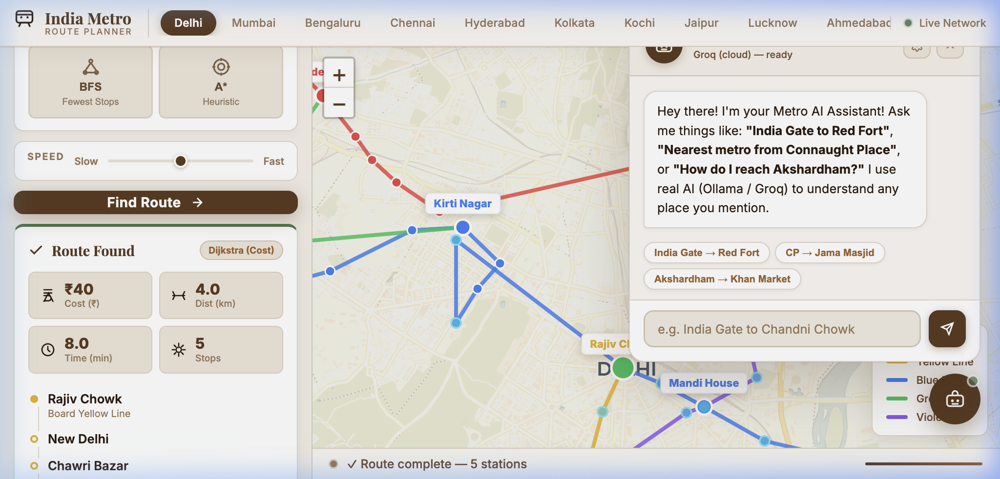
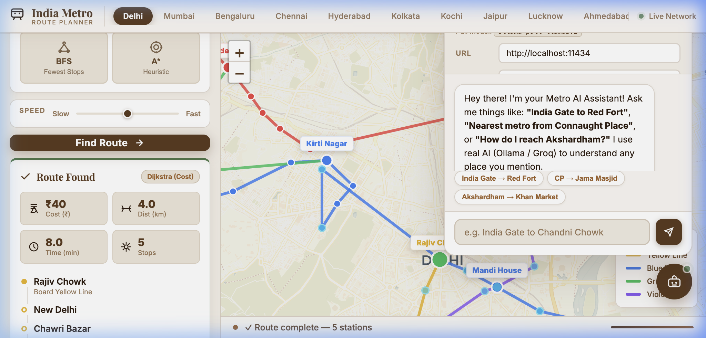

# India Metro Route Planner

A premium, interactive web application that provides real-time metro navigation for **12 major Indian cities**. Built with a luxurious "Paradise Stay" aesthetic, this app blends clean UI design with complex graph routing algorithms and advanced AI capabilities to offer a smooth commuting experience.

<p align="center">
  
</p>

## ✨ Key Features

- **12 Indian Cities Supported**: Delhi, Mumbai, Bengaluru, Chennai, Hyderabad, Kolkata, Kochi, Jaipur, Lucknow, Ahmedabad, Pune, and Nagpur.
- **Advanced Graph Algorithms**: 
  - **Dijkstra** (Min Cost / Min Distance)
  - **BFS** (Fewest Stops)
  - **A*** (Heuristic routing via geographic coordinates)
- **AI Chat Assistant**: Ask queries like *"Gateway of India to Airport"* in natural language! Integrated with:
  - **Ollama** (Local inference)
  - **Groq API** (Cloud inference)
  - Intelligent Rule-Based Fallback.
- **Interactive Leaflet Map**: Visualizes the entire metro graph with edge weights, line colors, and animated route plotting.
- **Luxurious UI**: Refined typography (*Playfair Display* & *Inter*), cream and brown color palette, glassmorphism, and custom SVG icons.

<p align="center">
  
  
</p>

## 🚀 Quick Start

1. **Install dependencies**:
   ```bash
   npm install
   ```

2. **Run the development server**:
   ```bash
   npm run dev
   ```

3. **Build for production**:
   ```bash
   npm run build
   ```

## 🧠 AI Configuration

You can configure the AI backend inside the app. Click the settings icon in the AI Chat panel to switch between **Ollama (local)** or **Groq (cloud)** and provide your respective API keys or endpoints.

<p align="center">
  
</p>

## 🛠️ Tech Stack

- **React + Vite** for optimal rendering and development speed.
- **Leaflet & React-Leaflet** for interactive mapping.
- **Vanilla CSS** following BEM conventions for lightweight styling without CSS-in-JS overhead.

## 🗃️ Legacy C++ Version

The original terminal-based C++ implementation of the Metro Route planner can be found in the Git commit history of this repository.

---
*Created by Himanshu Patel*
